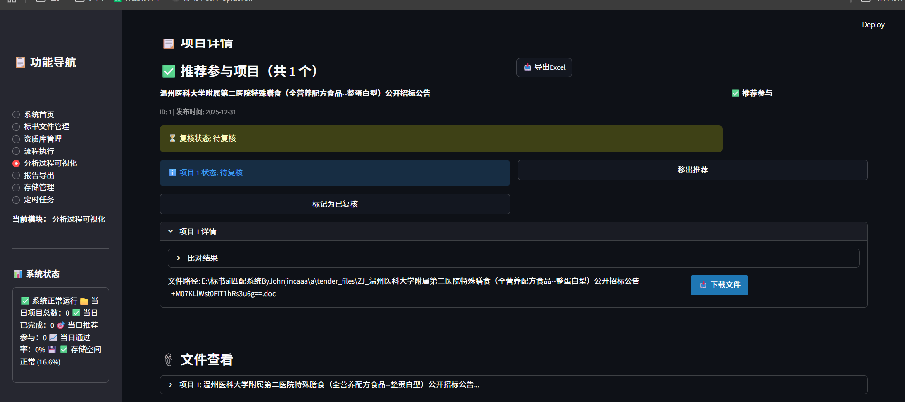
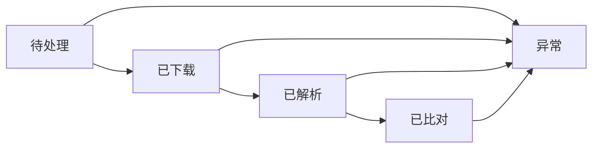

# 标书AI匹配系统 - 项目说明文档
<div >
    <strong>基于Python+Streamlit的智能化标书资质自动匹配解决方案</strong>
</div>

## 一、项目概述



本系统是面向招投标场景的智能化解决方案，基于Python与Streamlit构建，核心目标是实现标书资质匹配的自动化、智能化，降低人工筛选成本，提升标书响应效率。核心能力包括：
- 🕷️ 自动化爬取浙江省政府采购网招标公告，支持多区域/多分类筛选
- 📄 全格式标书解析（PDF/DOC/DOCX/ZIP等），兼容复杂表格与特殊格式
- 🤖 基于AI的资质要求提取与智能匹配，支持本地/云端双模型部署
- 📊 自动化生成结构化Excel匹配报告，可视化展示匹配结果
- 🗄️ 完善的资质库管理（A类证书库/B类规则库），支持灵活配置

## 二、技术栈选型
| 分类    | 技术/工具                | 版本/说明                                        |
|-------|----------------------|----------------------------------------------|
| 前端框架  | Streamlit            | 1.51.0（轻量化Web交互）                             |
| 后端语言  | Python               | 3.12（核心开发语言）                                 |
| 数据库   | SQLite               | 轻量级文件数据库，无需部署                                |
| AI引擎  | Ollama               | 支持本地（llama3:8b）/云端（qwen3-coder:480b-cloud）模型 |
| 核心依赖库 | LangChain            | AI应用开发框架                                     |
|       | SQLAlchemy           | 数据库ORM管理                                     |
|       | PyPDF2/PyMuPDF       | PDF文件解析                                      |
|       | python-docx/win32com | Word文档解析（兼容DOC/DOCX）                         |
|       | openpyxl             | Excel报告生成                                    |
|       | requests             | 网络请求（爬虫核心）                                   |

## 三、项目目录结构
```
a/
├── app.py                      # Streamlit主应用入口（Web交互核心）
├── config.py                   # 全局配置中心（爬虫/AI/存储等）
├── auto_run_full_process.py    # 命令行全流程执行脚本
├── check_task_status.py        # 任务状态监控脚本
├── requirements.txt            # Python依赖清单
├── tender_system.db           # SQLite核心数据库
├── task_schedules.json        # 定时任务配置文件
│
├── spider/                    # 爬虫模块
│   └── tender_spider.py      # 浙江省政府采购网爬虫（多区域/分类支持）
│
├── parser/                    # 文件解析模块
│   └── file_parser.py        # 多格式标书解析器（PDF/DOC/DOCX/ZIP）
│
├── ai/                        # AI分析模块
│   └── qualification_analyzer.py  # 资质提取/比对/服务类判断核心
│
├── report/                    # 报告生成模块
│   └── report_generator.py   # Excel匹配报告生成器（样式/筛选优化）
│
├── utils/                     # 通用工具模块
│   ├── db.py                 # 数据库操作（CRUD/索引优化）
│   ├── log.py                # 日志管理（轮转/分级）
│   ├── task_scheduler.py     # Windows定时任务管理
│   ├── storage_manager.py    # 存储空间监控/清理
│   └── auto_cleanup.py       # 旧文件自动清理脚本
│
├── tasks/                     # 任务调度模块
│   └── scheduler.py          # Celery任务调度（可选扩展）
│
├── prompts/                   # AI提示词模板库
│   ├── extract_prompt.txt    # 资质提取提示词
│   ├── compare_prompt.txt    # 资质比对提示词
│   └── service_check_prompt.txt  # 服务类项目判断提示词
│
├── docs/                      # 专项文档目录
│   ├── SPIDER_QUOTA_LOGIC.md  # 爬虫配额逻辑说明
│   ├── SPIDER_DAYS_BEFORE_LOGIC.md # 时间筛选逻辑说明
│   └── ...
│
├── tender_files/              # 标书文件存储目录（分类存储）
├── reports/                   # 匹配报告输出目录
└── logs/                      # 系统日志目录（按日期轮转）
```

## 四、核心功能模块
### 4.1 爬虫模块（spider/tender_spider.py）
#### 核心能力
- 定向爬取浙江省政府采购网（zfcg.czt.zj.gov.cn）招标公告
- 支持「政府类/非政府类」分类+12个地级市区域精准筛选
- 自动下载标书文件，兼容PDF/DOC/DOCX等格式

#### 关键配置（config.py）
```python
SPIDER_CONFIG = {
    "daily_limit": 4,              # 每日爬取数量限制（防反爬）
    "zhejiang_max_pages": 35,      # 单来源最大爬取页数
    "anti_crawl": {
        "request_interval": 2,     # 请求间隔（秒）
        "retry_times": 3,          # 失败重试次数
        "timeout": 15              # 网络超时阈值
    }
}
```

#### 特性
- ✅ 基于project_id的全量去重，避免重复爬取
- ✅ 按区域/分类均衡爬取，保证数据覆盖度
- ✅ 失败自动重试，异常链路监控

### 4.2 文件解析模块（parser/file_parser.py）
#### 支持格式
| 格式   | 解析方案                        | 特殊处理             |
|------|-----------------------------|------------------|
| PDF  | PyPDF2主解析 + Tesseract OCR兜底 | 表格提取、合并单元格处理     |
| DOCX | python-docx                 | 宏文件（DOCM）转换后解析   |
| DOC  | Word COM组件 / LibreOffice转换  | 自动清理Word进程，防资源泄漏 |
| ZIP  | 自动解压                        | 识别压缩包内招标文件       |
| TXT  | 原生读取                        | 编码自动识别           |

#### 核心特性
- 完整提取标书内评分表内容，保留原始格式
- 文件锁机制，避免多进程并发解析冲突
- 超时控制，适配大文件（>50MB）解析

### 4.3 AI分析模块（ai/qualification_analyzer.py）
#### 核心能力
1. **资质提取**：从标书文本中精准提取评分办法、资质要求等核心信息
2. **资质匹配**：对比公司A类证书库/B类规则库，输出匹配结果
3. **服务类过滤**：自动识别服务类项目（如咨询/编辑），过滤非目标标书

#### AI配置
```python
AI_CONFIG = {
    "provider": "ollama",
    "ollama": {
        "default_model": "cloud",  # 本地/云端模型切换
        "local_model": {"model": "llama3:8b", "host": "localhost:11434"},
        "cloud_model": {"model": "qwen3-coder:480b-cloud", "timeout": 60}
    },
    "rate_limiting": {  # 限流配置，避免模型过载
        "enable": True,
        "max_requests_per_hour": 80,
        "min_interval_seconds": 30
    }
}
```

#### 匹配规则
- **A类证书库**：精准匹配证书名称/编号/有效期等硬性要求
- **B类规则库**：灵活匹配业绩、检测报告、承诺响应等柔性要求
- **排除规则**：过滤要求政府官网备案的特殊场景

### 4.4 报告生成模块（report/report_generator.py）
#### 核心能力
- 生成标准化Excel匹配报告，支持多维度筛选
- 自动计算客观分可得分/得分率，区分主观/客观评分项
- 自定义表头样式、自动筛选、条件格式化，提升可读性

#### 核心报告字段
| 分类     | 字段示例               |
|--------|--------------------|
| 项目基础信息 | 项目ID、名称、省份/城市、发布时间 |
| 文件信息   | 文件格式、存储路径、解析状态     |
| 匹配结果   | 资质匹配度、客观分总分、最终判定   |
| 异常信息   | 解析错误、AI分析失败原因      |

### 4.5 数据库模块（utils/db.py）
#### 核心数据表设计
| 表名                     | 核心用途            | 索引优化字段                         |
|------------------------|-----------------|--------------------------------|
| tender_projects        | 项目主表（全生命周期状态管理） | project_id、status、publish_time |
| company_qualifications | 公司资质总表          | qualification_type             |
| class_a_certificates   | A类证书库（精准匹配）     | cert_name、valid_until          |
| class_b_rules          | B类规则库（灵活匹配）     | rule_type、trigger_condition    |

## 五、系统配置说明
### 5.1 核心配置（config.py）
```python
# 存储配置
STORAGE_CONFIG = {
    "auto_cleanup_enabled": True,    # 自动清理开关
    "cleanup_interval_days": 30,     # 保留最近30天文件
    "disk_warning_threshold": 80.0,  # 磁盘使用率告警阈值（%）
}
```

## 六、使用指南
### 6.1 Web界面使用（Streamlit）
#### 启动命令
```bash
streamlit run app.py
```

#### 核心功能页面
| 页面名称 | 核心功能                |
|------|---------------------|
| 项目列表 | 全量项目查询、多维度筛选、关键词搜索  |
| 流程控制 | 爬虫/解析/AI分析/报告生成一键执行 |
| 资质管理 | A类证书/B类规则增删改查、批量导入  |
| 定时任务 | Windows定时任务创建/编辑/删除 |
| 存储管理 | 磁盘使用率监控、旧文件手动清理     |

### 6.2 命令行使用
#### 全流程执行
```bash
python auto_run_full_process.py \
  --daily-limit 10 \    # 每日爬取数量
  --days-before 0 \     # 爬取时间范围（0=当日）
  --model-type cloud \  # AI模型类型（local/cloud）
  --test-mode           # 测试模式（仅爬取2个文件）
```

### 6.3 定时任务
- 方式1：Web界面「定时任务」模块可视化配置
- 方式2：通过`utils/task_scheduler.py`脚本手动创建
- 支持按日/周/月执行，自动触发全流程任务

## 七、项目状态流转

- **待处理**：项目初始化状态，等待爬取
- **已下载**：标书文件下载完成，待解析
- **已解析**：标书内容提取完成，待AI分析
- **已比对**：AI资质匹配完成，可生成报告
- **异常**：任意环节失败（如下载失败、解析超时、AI调用异常）

## 八、核心特性
### 8.1 容错机制
- 解析/AI分析失败自动重试（最多3次）
- 多次失败自动标记「跳过-多次失败」，不阻塞整体流程

### 8.2 智能过滤
- 服务类项目自动识别并过滤，聚焦核心标书
- 主观/客观分自动区分，精准计算可得分

### 8.3 存储管理
- 自动清理30天前的标书/报告文件，释放磁盘空间
- 磁盘使用率实时监控，阈值告警（80%）

### 8.4 日志体系
- 分级日志：主日志（tender_system.log）+ 自动运行日志（按时间戳命名）
- 日志轮转：100MB自动切割，保留7天历史日志

## 九、环境部署
### 9.1 依赖安装
```bash
pip install -r requirements.txt
```

### 9.2 特殊依赖配置
| 依赖名称           | 用途        | 配置路径                                       |
|----------------|-----------|--------------------------------------------|
| Tesseract OCR  | PDF OCR识别 | config.py → PARSE_CONFIG["tesseract_path"] |
| Poppler        | PDF处理辅助   | config.py → PARSE_CONFIG["poppler_path"]   |
| Microsoft Word | DOC文件解析   | 需安装完整版，建议管理员权限运行                           |
| Ollama         | AI模型服务    | 启动命令：ollama serve（端口11434）                 |

## 十、常见问题排查
| 问题现象          | 排查方案                                                       |
|---------------|------------------------------------------------------------|
| Word COM组件不可用 | 1. 确认安装完整版Word；2. 管理员身份运行程序；3. 切换LibreOffice方案             |
| Ollama连接失败    | 1. 检查ollama serve是否启动；2. 端口11434是否被占用；3. 防火墙放行端口           |
| 文件解析超时        | 1. 调整file_parser.py中parse_timeout_seconds；2. 拆分超大文件（>50MB） |
| SQLite数据库锁定   | 1. 避免并发写入；2. 等待30s后重试；3. 检查数据库连接是否正常关闭                     |

## 十一、开发扩展指南
### 11.1 新增爬虫源
1. 在`spider/`目录创建新爬虫类，实现`run()`核心方法
2. 在`tender_spider.py`的`run_all_spiders()`中注册新爬虫
3. 配置爬取规则、反爬策略，接入统一去重逻辑

### 11.2 新增B类规则
- 方式1：Web界面「资质管理 → B类规则库」可视化添加
- 方式2：在config.py的`B_RULE_CONFIG["default_rules"]`中添加规则配置

### 11.3 修改AI提示词
1. 编辑`prompts/`目录下对应txt文件
2. 重启Streamlit应用，提示词自动生效

## 十二、版本与维护信息
| 项⽬          | 详情            |
|-------------|---------------|
| Python版本    | 3.12+         |
| Streamlit版本 | 1.51.0        |
| 数据库         | SQLite（无版本依赖） |
| 最后更新        | 2025-01-02    |
| 维护者         | Johnjincaaa   |

## 十三、注意事项
1. 📌 **数据安全**：定期备份`tender_system.db`数据库，避免数据丢失
2. 📌 **存储管理**：建议每周手动核查磁盘空间，清理非必要文件
3. 📌 **AI服务**：确保Ollama服务常驻运行，核心模型已提前下载
4. 📌 **网络环境**：爬虫依赖稳定网络，建议配置代理避免IP封禁
5. 📌 **系统兼容**：Word COM组件仅支持Windows，Linux需切换LibreOffice方案

---
<div >
    <strong>© 2025 Johnjincaaa | 未经允许禁止商用</strong>
</div>